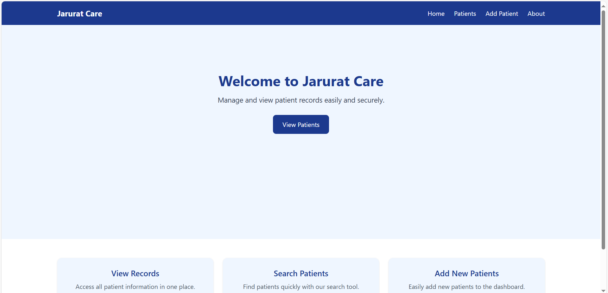
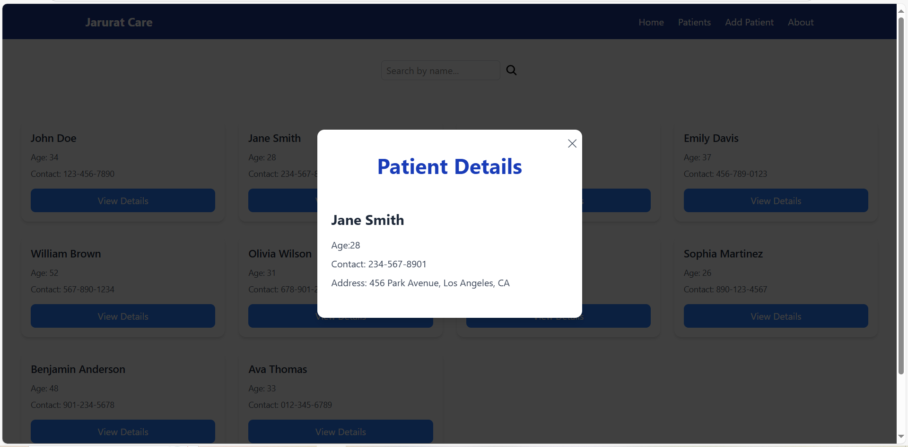

# Jarurat Care - Patient Records Dashboard

A simple patient records dashboard built with **React**, **Redux**, and **Tailwind CSS**. Easily manage, view, and add patient records with a clean and responsive UI.

## Features

- 🏠 **Home Page:** Welcome screen with quick navigation.
- 👨‍⚕️ **Patients List:** View all patients, search by name, and see details in a modal.
- ➕ **Add Patient:** Add new patient records via a simple form.
- ℹ️ **About Page:** Learn about the project and technologies used.
- 🖥️ **Responsive Design:** Works well on desktop and mobile devices.

## Technologies Used

- [React](https://reactjs.org/)
- [Redux Toolkit](https://redux-toolkit.js.org/)
- [React Router](https://reactrouter.com/)
- [Tailwind CSS](https://tailwindcss.com/)

## Getting Started

### 1. Clone the repository

```bash
git clone https://github.com/rukadikar123/Patient-Records-Dashboard.git
cd Patient-Records-Dashboard
```

### 2. Install dependencies

```bash
npm install
```

### 3. Start the development server

```bash
npm start
```

The app will run at [https://patient-records-dashboard-one.vercel.app/](https://patient-records-dashboard-one.vercel.app/).

## Project Structure

```
src/
  Components/      # Reusable UI components (Navbar, Footer, PatientCard, etc.)
  Pages/           # Main pages (Home, Patients, AddPatient, About)
  Redux/           # Redux store and slices
  MockData.js      # Sample patient data
  App.jsx          # Main app component with routes
```

## Screenshots






## License

This project is licensed under the MIT License.

---

